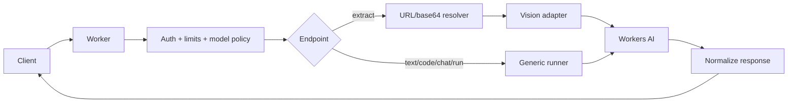
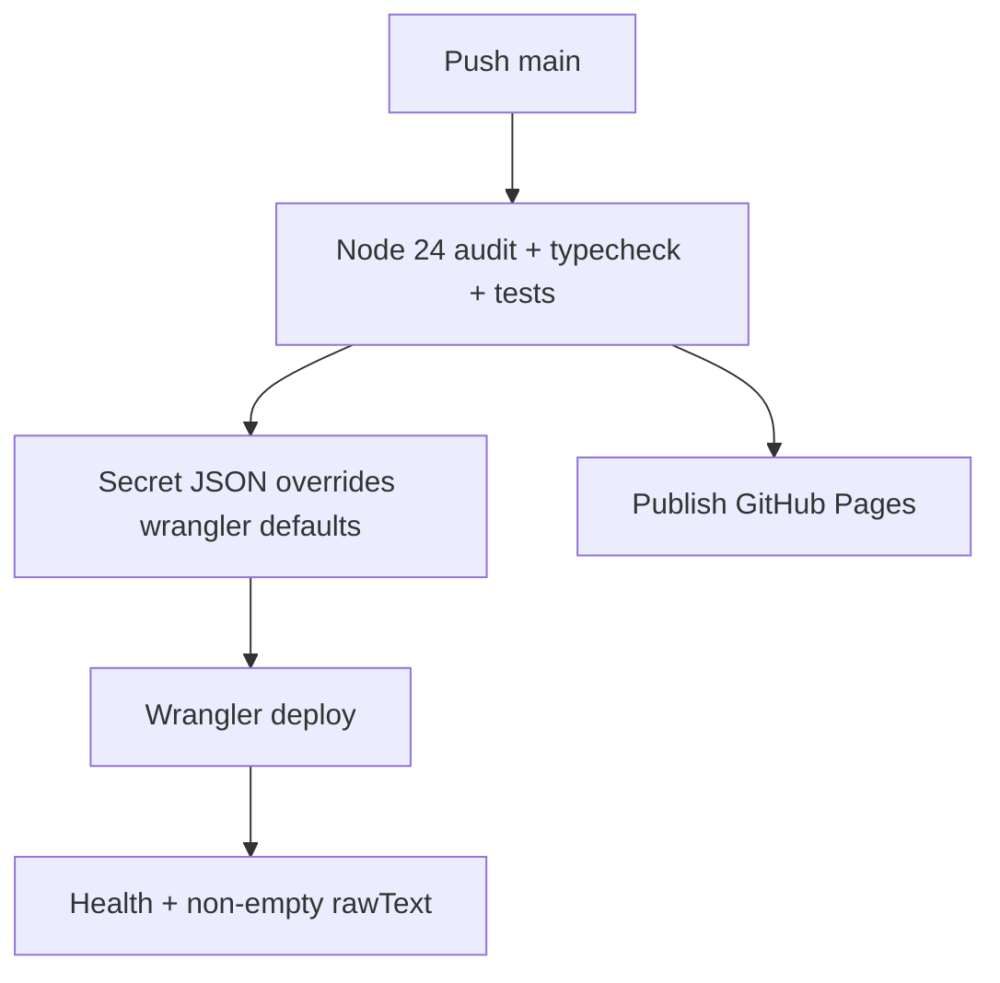

# Cloudflare Worker Image HOS + Workers AI Gateway

[](https://deploy.workers.cloudflare.com/?url=https://github.com/oh250515-ai/cloudfare-worker-image-hos)

A globally deployed Cloudflare Worker that exposes image extraction, text, code, chat and raw Workers AI inference behind one stable API. Clients choose model, prompt, parameters and output schema per request; Cloudflare handles GPU inference.

## Deploy options

### One-click Cloudflare deployment

Click **Deploy to Cloudflare** above. Cloudflare clones the repository, provisions the Workers AI binding and deploys with public defaults from `wrangler.jsonc`. No GitHub Actions credential secret is required for this path because Cloudflare authenticates the deployment through its own OAuth flow.

After deployment, add the optional runtime secret `API_KEY` in Worker Settings if the API must be protected.

### GitHub Actions deployment

Create repository secret `CLOUDFLARE_CONFIG_JSON`, then push to `main`. GitHub Actions tests, audits, deploys the Worker, enables workers.dev, publishes Pages and runs smoke tests.

## Configuration precedence

For **non-secret settings**, resolution is:

```text
CLOUDFLARE_CONFIG_JSON field, when non-empty
  ↓ fallback
wrangler.jsonc vars
  ↓ fallback
hardcoded application default, only where documented
```

Credentials and `apiKey` are never read from `wrangler.jsonc`. They must stay in GitHub Secrets or Cloudflare Worker Secrets.

## Public defaults in wrangler.jsonc

Wrangler only supports runtime variables under `vars`, so camelCase deployment fields map to uppercase variables:

```jsonc
{
  "vars": {
    "ALLOWED_MODELS": "*",
    "DEFAULT_MODEL": "@cf/moondream/moondream3.1-9B-A2B",
    "DEFAULT_TEXT_MODEL": "@cf/zai-org/glm-4.7-flash",
    "DEFAULT_CODE_MODEL": "@cf/zai-org/glm-5.2",
    "MAX_IMAGE_BYTES": "8388608",
    "FETCH_TIMEOUT_MS": "12000",
    "TEST_IMAGE_URL": "https://pgurpzubjhgilszrscdl.storage.supabase.co/storage/v1/object/public/o25.ip8plus.0424/public-bucket-proxy/DESKTOP-281KMLH-Arc-2026-07-08-11h35p30.005.png",
    "WORKERS_SUBDOMAIN": "oh25-0515"
  }
}
```

`TEST_IMAGE_URL` and `WORKERS_SUBDOMAIN` are CI deployment helpers. The parser removes them from the generated runtime config before deployment. All other fields become Worker runtime variables.

## Secret JSON overrides

```json
{
  "accountId":"32-character-account-id",
  "apiToken":"scoped-cloudflare-token",
  "apiKey":"runtime-client-key",
  "allowedModels":"@cf/mistralai/*,@cf/zai-org/*",
  "defaultModel":"@cf/mistralai/mistral-small-3.1-24b-instruct",
  "textModel":"@cf/zai-org/glm-4.7-flash",
  "codeModel":"@cf/zai-org/glm-5.2",
  "maxImageBytes":"8388608",
  "fetchTimeoutMs":"12000",
  "testImageUrl":"https://example.com/safe-test.png",
  "workersSubdomain":"oh25-0515"
}
```

If one of these public fields is absent or empty, its `wrangler.jsonc` value is used. Global-key authentication may replace `apiToken` with `email` + `apiGlobalToken`.

## Field mapping

| Secret JSON | wrangler.jsonc var | Effect |
| --- | --- | --- |
| `allowedModels` | `ALLOWED_MODELS` | Exact IDs, comma list, globs, or `*` for any safe `@cf/author/model` request input |
| `defaultModel` | `DEFAULT_MODEL` | Default image/vision model |
| `textModel` / `defaultTextModel` | `DEFAULT_TEXT_MODEL` | Default `/v1/text` and `/v1/chat` model |
| `codeModel` / `defaultCodeModel` | `DEFAULT_CODE_MODEL` | Default `/v1/code` model |
| `maxImageBytes` | `MAX_IMAGE_BYTES` | Maximum decoded/downloaded image size |
| `fetchTimeoutMs` | `FETCH_TIMEOUT_MS` | Remote image fetch timeout |
| `testImageUrl` | `TEST_IMAGE_URL` | CI smoke-test image only |
| `workersSubdomain` | `WORKERS_SUBDOMAIN` | Account workers.dev prefix only |

## API endpoints

| Method | Path | Purpose |
| --- | --- | --- |
| `GET` | `/health` | Uptime |
| `GET` | `/v1/models` | Defaults and model policy |
| `POST` | `/v1/extract` | URL/base64 image to `rawText`, data and annotations |
| `POST` | `/v1/text` | Text generation |
| `POST` | `/v1/code` | Code generation |
| `POST` | `/v1/chat` | Message-based chat |
| `POST` | `/v1/run` | Raw model-specific input |

## Main flows





## Development rules

1. Read `AGENTS.md`, `SPEC.md`, API, deployment, model and security docs before editing.
2. Keep model-specific behavior inside adapters; preserve the stable response envelope.
3. Never hardcode business fields. Callers own prompts and schemas.
4. Never commit credentials or log production image content.
5. Run `npm install --legacy-peer-deps`, `npm audit --audit-level=high`, and `npm run check` before push.
6. Validate model IDs and input schemas against current official Cloudflare documentation.

## Roadmap

- Benchmark stronger vision models on the same Vietnamese UI corpus.
- Add dedicated OCR-engine fallback instead of relying only on VLMs.
- Add rate limiting, Cloudflare Access and source-domain allowlists.
- Add schema validation, async batches, PDF support and benchmark telemetry.

## Links

[API docs](docs/API.md) · [Deployment](docs/DEPLOY.md) · [Models](docs/MODELS.md) · [Vision benchmark](docs/VISION_BENCHMARK.md) · [Changelog](CHANGELOG.md) · [Release v2.1.0](https://github.com/oh250515-ai/cloudfare-worker-image-hos/releases/tag/v2.1.0)
