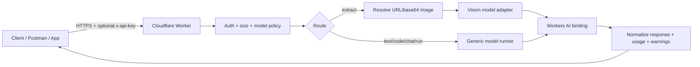
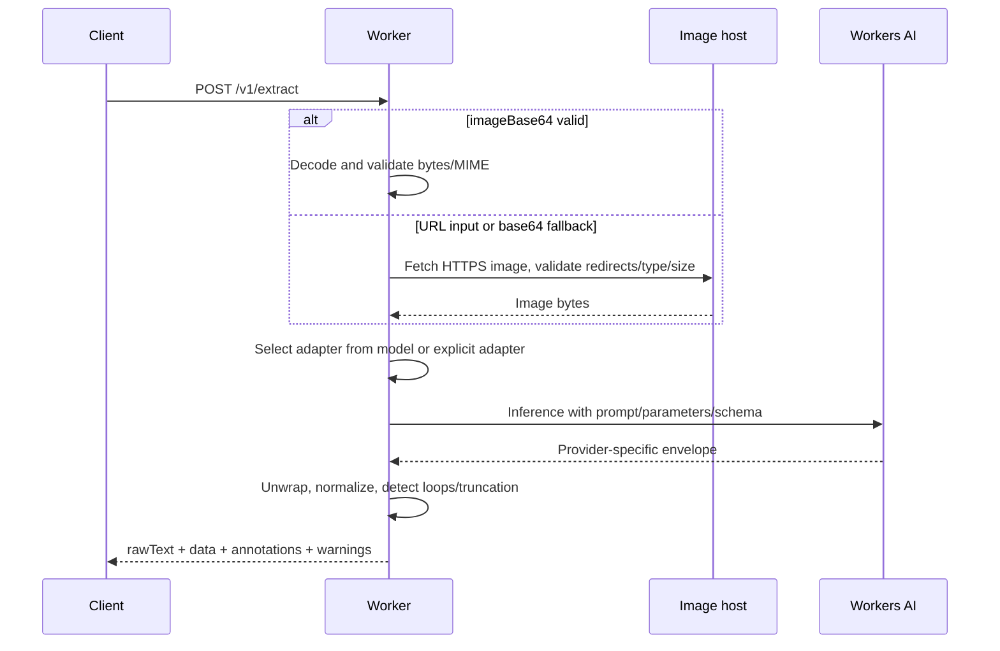
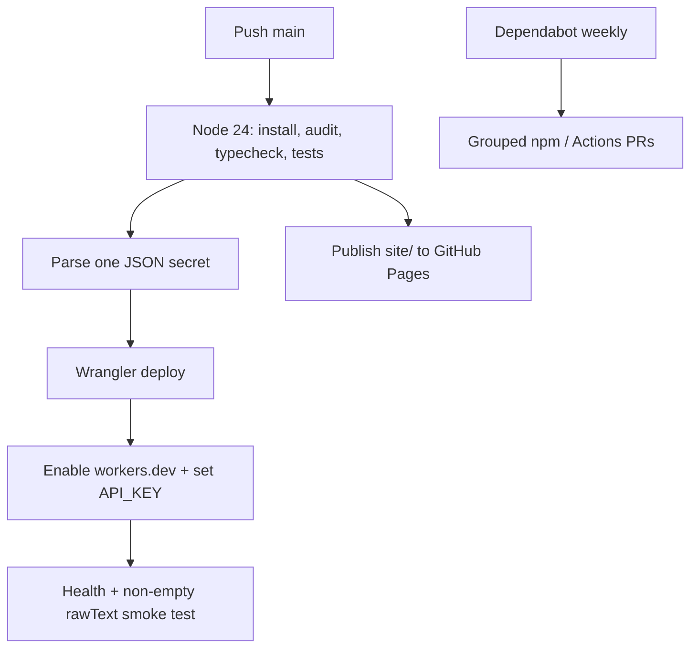

# Cloudflare Worker Image HOS + Workers AI Gateway

A globally deployed Cloudflare Worker that exposes image extraction, text, code, chat and raw Workers AI inference behind one stable API. It stays stateless: clients choose the model, prompt, parameters and output schema per request; Cloudflare handles GPU inference.

## Live services

- API: `https://cloudfare-worker-image-hos.oh25-0515.workers.dev`
- Documentation: https://oh250515-ai.github.io/cloudfare-worker-image-hos/
- Playground: https://oh250515-ai.github.io/cloudfare-worker-image-hos/playground.html
- Model guide: https://oh250515-ai.github.io/cloudfare-worker-image-hos/models.html

## What the project does

| Endpoint | Purpose |
| --- | --- |
| `GET /health` | Uptime check |
| `GET /v1/models` | Active defaults, allow policy and vision adapters |
| `POST /v1/extract` | URL/base64 image to `rawText`, structured `data`, annotations and model metadata |
| `POST /v1/text` | Text generation from a prompt or messages |
| `POST /v1/code` | Code-focused generation |
| `POST /v1/chat` | OpenAI-style message chat |
| `POST /v1/run` | Raw passthrough for model-specific input schemas |

Text/code/chat/run also support bounded benchmark mode (maximum five models and five runs).

## Architecture



### Image extraction flow



### Deployment flow



## One-secret configuration

Create repository secret `CLOUDFLARE_CONFIG_JSON`. Strict JSON uses straight quotes, no comments and no trailing comma.

```json
{
  "accountId":"32-character-account-id",
  "email":"cloudflare-login@example.com",
  "apiGlobalToken":"global-api-key",
  "apiKey":"runtime-client-api-key",
  "allowedModels":"*",
  "defaultModel":"@cf/mistralai/mistral-small-3.1-24b-instruct",
  "textModel":"@cf/zai-org/glm-4.7-flash",
  "codeModel":"@cf/zai-org/glm-5.2",
  "maxImageBytes":"8388608",
  "fetchTimeoutMs":"12000",
  "testImageUrl":"https://public.example/test.png",
  "workersSubdomain":"oh25-0515"
}
```

### Configuration reference

| JSON field | Required | Accepted values | Effect | How to obtain |
| --- | --- | --- | --- | --- |
| `accountId` | Yes | Cloudflare account ID | Selects deployment account | Cloudflare Account home, account menu, **Copy account ID** |
| `apiToken` | One auth mode | Scoped API Token | Preferred CI authentication | My Profile → API Tokens → Create Token; grant Workers Scripts Edit and Workers AI permissions |
| `email` + `apiGlobalToken` | Other auth mode | Login email + Global API Key | Legacy broad authentication | My Profile; API Tokens → API Keys → View Global API Key |
| `apiKey` | No | Any strong random string | Protects API routes via `x-api-key` or Bearer | Generate with `openssl rand -hex 32` |
| `allowedModels` | No | Exact ID, comma list, glob, or `*` | Controls request `model` values | See model catalog. Examples below |
| `defaultModel` | No | Vision-capable `@cf/...` ID | Default for `/v1/extract` | Choose from model guide and benchmark |
| `textModel` / `defaultTextModel` | No | Text model ID | Default for `/v1/text` and `/v1/chat` | Cloudflare model catalog |
| `codeModel` / `defaultCodeModel` | No | Coding model ID | Default for `/v1/code` | Cloudflare model catalog |
| `maxImageBytes` | No | Positive integer string | Max decoded/downloaded image size | Default `8388608` (8 MiB) |
| `fetchTimeoutMs` | No | Positive integer string | Remote image timeout | Default `12000` |
| `testImageUrl` | No | Public HTTPS image URL | Post-deploy smoke fixture | Use non-sensitive public image |
| `workersSubdomain` | No | Prefix only, no `.workers.dev` | Creates account subdomain if absent | Existing URL `script.PREFIX.workers.dev`; here `oh25-0515` |

`allowedModels` examples:

```text
*                                                   any syntactically valid @cf/author/model
@cf/mistralai/mistral-small-3.1-24b-instruct       one exact model
@cf/mistralai/*                                    every MistralAI model under @cf
@cf/mistralai/*,@cf/zai-org/*,@cf/moonshotai/*    comma-separated glob policy
```

`*` exists because every inference request can supply its own `model`. It does **not** accept arbitrary URLs or external provider names; the Worker still requires `@cf/author/model`.

## API examples

```bash
BASE=https://cloudfare-worker-image-hos.oh25-0515.workers.dev
KEY=YOUR_RUNTIME_API_KEY

curl -s "$BASE/v1/text" -H "x-api-key: $KEY" -H 'content-type: application/json' \
  -d '{"model":"@cf/zai-org/glm-4.7-flash","prompt":"Tóm tắt nội dung sau: ..."}'

curl -s "$BASE/v1/code" -H "x-api-key: $KEY" -H 'content-type: application/json' \
  -d '{"model":"@cf/zai-org/glm-5.2","prompt":"Viết TypeScript retry helper có test"}'

curl -s "$BASE/v1/extract" -H "x-api-key: $KEY" -H 'content-type: application/json' \
  -d '{"imageUrl":"https://example.com/screen.png","prompt":"OCR toàn bộ","output":{"includeRawText":true}}'
```

## Vision benchmark

Current measured baseline on the dense DHG Vietnamese WinForms screenshot: Moondream returns non-empty text but only **2/6 exact anchors**. This passes availability smoke, not production accuracy. See [Vision benchmark report](docs/VISION_BENCHMARK.md) and [model guide](docs/MODELS.md).

## Development rules

1. Read `AGENTS.md`, `SPEC.md`, `docs/API.md`, `docs/DEPLOY.md`, `docs/MODELS.md`, `SECURITY.md` before editing.
2. Preserve the stable response envelope; add model-specific logic only inside adapters.
3. Never hardcode business fields into the Worker. Prompts and caller schemas own the business contract.
4. Never log credentials, image bytes, prompts or extracted production text. CI fixtures must contain no sensitive data.
5. Reject unsafe URLs, unbounded bodies and disallowed models before inference.
6. Run `npm install --legacy-peer-deps`, `npm audit --audit-level=high` and `npm run check` before pushing.
7. Every model change needs official-doc verification and a real fixture regression test.
8. Smoke success means API health and non-empty `rawText`; quality thresholds belong in benchmark reports, not availability gates.

## Roadmap

- Benchmark Mistral Small 3.1, Gemma 4, Llama 4 Scout and Kimi K2.7 on the same Vietnamese UI corpus.
- Add a dedicated OCR engine fallback (for example NVIDIA Nemotron OCR or managed OCR) instead of forcing VLMs to transcribe every pixel.
- Add schema validation and model-specific parameter allowlists.
- Add rate limiting, Cloudflare Access and source-domain allowlists for public production use.
- Persist optional benchmark telemetry to Analytics Engine or D1 without storing image content.
- Add async batch processing for large image sets and PDFs.
- Generate runtime types with `wrangler types` and add Workers-runtime integration tests.

## Release and maintenance

- Changelog: [CHANGELOG.md](CHANGELOG.md)
- Dependabot checks npm and GitHub Actions weekly, grouped by toolchain.
- Release `v2.1.0` is created automatically if absent by the release workflow.

## Documentation

[API](docs/API.md) · [Deployment](docs/DEPLOY.md) · [Models](docs/MODELS.md) · [Benchmark](docs/VISION_BENCHMARK.md) · [Security](SECURITY.md) · [Agent rules](AGENTS.md)
